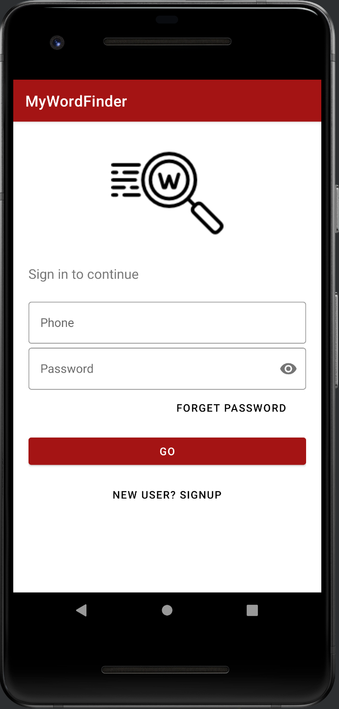
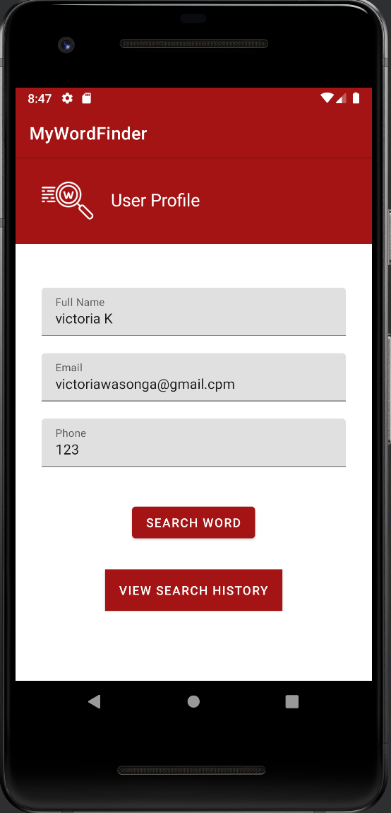
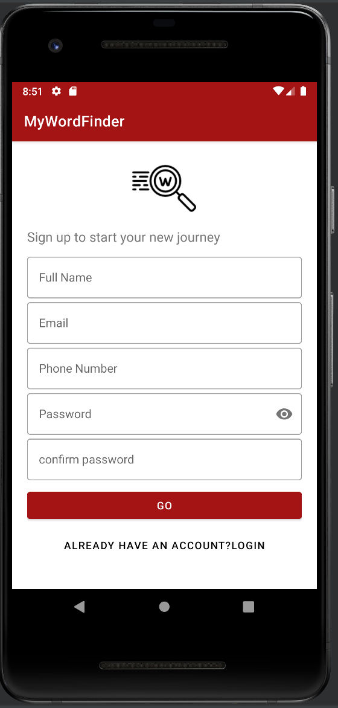

# Word Finder Android App
---
## Project Description
This is a simple Android application that allows a user to enter their a word select an option whether they want to get the related word, the words that sounds like the word,
words that rhyme with the word and adjectives that describe the word.

##Screen Shorts
   

## Author Information
[Victoria Okumu](https://github.com/vokumu)
## Setup/Installation Requirements
To start using this project use the following:
1. Make sure you installed java and android studio applications

3. git clone

4. Open the directory with android studio  and run with your prefered AVD.

## Known Bugs
There are no known bugs
## Technologies Used
* Android Studio
* Java
* Android
# Contact Information
- Email <victoriawasonga@gmail.com>

## License
[MIT](LICENSE)
Permission is hereby granted, free of charge, to any person obtaining a copy of this software and associated documentation files (the "Software"), to deal in the Software without restriction, including without limitation the rights to use, copy, modify, merge, publish, distribute, sublicense, and/or sell copies of the Software, and to permit persons to whom the Software is furnished to do so, subject to the following conditions:
<<<<<<< HEAD
The above copyright notice and this permission notice shall be included in all copies or substantial portions of the Software.
=======
The above copyright notice and this permission notice shall be included in all copies or substantial portions of the Software.
>>>>>>> bd5541b1becd68d21f85c8f984283357c8482608
